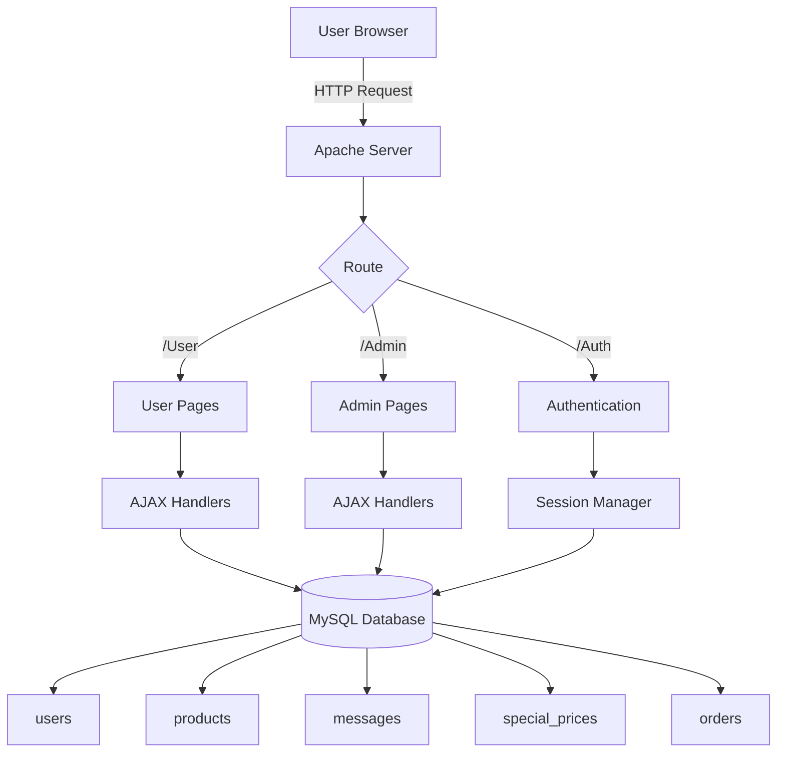

#  Halima Seafood Market - E-Commerce Platform

##  Project Overview

**Halima Seafood Market** is a comprehensive e-commerce platform designed specifically for selling fresh and frozen seafood products. The system connects customers with premium quality seafood through an intuitive online marketplace, featuring real-time chat negotiation, special pricing, and a complete order management system.

### What Does This Project Do?

This platform enables:
- **Customers** to browse seafood products, negotiate prices, and place orders
- **Administrators** to manage inventory, communicate with customers, and set personalized pricing
- **Real-time messaging** between customers and admin for price negotiation and inquiries
- **Special pricing offers** that can be customized per user with automatic expiration

### How Does It Work?

The system follows a **client-server architecture** with:
1. **Frontend**: Dynamic PHP pages with Tailwind CSS for responsive UI
2. **Backend**: PHP handlers processing AJAX requests
3. **Database**: MySQL storing users, products, orders, messages, and special prices
4. **Session Management**: Secure PHP sessions with early lock release for performance

##  System Architecture

### Technology Stack

#### Backend
- **Language**: PHP 7.4+
- **Database**: MySQL 5.7+
- **Session Management**: PHP Sessions with optimized locking
- **Why PHP?**: 
  - Easy to deploy on XAMPP
  - Excellent MySQL integration
  - Fast development cycle for dynamic web applications
  - Strong session management capabilities

#### Frontend
- **Styling**: Tailwind CSS (CDN)
- **Icons**: Font Awesome 6.4.0
- **Fonts**: Plus Jakarta Sans (Google Fonts)
- **JavaScript**: Vanilla JS with Fetch API for AJAX
- **Why Tailwind CSS?**:
  - Rapid UI development
  - Consistent design system
  - Highly customizable
  - Modern, professional appearance

#### Database Design
- **Engine**: InnoDB (supports foreign keys and transactions)
- **Tables**: 
  - `users` - Authentication and user management
  - `products` - Seafood inventory
  - `orders` - Purchase transactions
  - `messages` - Real-time chat system
  - `special_prices` - Personalized pricing offers

---

##  Project Structure

```
Halima Seafood Market/
│
├── Admin/                      # Admin Dashboard & Management
│   ├── index.php              # Admin dashboard home
│   ├── messages.php           # Admin chat interface with custom offer feature
│   ├── products.php           # Product inventory management
│   ├── orders.php             # Order management system
│   ├── users.php              # User management
│   ├── reports.php            # Analytics and reports
│   └── handlers/              # Backend processing scripts
│       ├── message_handler.php    # Chat message CRUD operations
│       ├── price_handler.php      # Special pricing system
│       └── [other handlers]
│
├── User/                       # Customer-Facing Pages
│   ├── index.php              # Homepage
│   ├── shop.php               # Product catalog with filters
│   ├── product_details.php    # Detailed product view with negotiation
│   ├── cart.php               # Shopping cart
│   ├── checkout.php           # Payment and order finalization
│   ├── contact.php            # Customer chat interface
│   ├── order_success.php      # Order confirmation page
│   ├── about.php              # About us page
│   └── handlers/              # User-side backend handlers
│       └── chat_handler.php       # User chat operations
│
├── Auth/                       # Authentication System
│   ├── index.php              # Login/Register combined page
│   ├── login_handler.php      # Login processing
│   └── register_handler.php   # Registration processing
│
├── Includes/                   # Shared Components
│   ├── db.php                 # Database connection & sanitize function
│   ├── price_helper.php       # Special pricing logic
│   ├── user_header.php        # Customer site header
│   ├── user_footer.php        # Customer site footer
│   ├── admin_header.php       # Admin dashboard header
│   └── admin_sidebar.php      # Admin navigation sidebar
│
├── Images/                     # Media Assets
│   ├── products/              # Product images
│   └── Logo.png               # Site logo
│
├── Assets/                     # Additional Resources
│   └── [CSS, JS files if any]
│
├── database.sql               # Database schema with sample data
├── index.php                  # Root redirect to User homepage
└── [Debug/utility files]
```


##  Detailed File Breakdown

### 1️. Admin Folder

#### `Admin/index.php`
**Purpose**: Admin dashboard homepage displaying key metrics and recent activity.
**Connections**: 
- Database: Fetches statistics from `users`, `products`, `orders`
- Includes: `admin_header.php`, `admin_sidebar.php`

#### `Admin/messages.php`
**Purpose**: Real-time chat interface for admin to communicate with customers.
**Key Features**:
- View all customer conversations
- Send/receive messages
- **Custom Offer Button**: Click to set special prices for specific users
- Auto-refresh every 5 seconds
**Connections**:
- Database: `messages`, `users`, `products`, `special_prices`
- AJAX: `handlers/message_handler.php`, `handlers/price_handler.php`
- Session: Stores admin ID, releases lock early for performance

#### `Admin/products.php`
**Purpose**: Manage product inventory (add, edit, delete products).
**Connections**:
- Database: CRUD operations on `products` table

#### `Admin/orders.php`
**Purpose**: View and manage customer orders.
**Connections**:
- Database: `orders`, `users`, `products`

#### `Admin/handlers/message_handler.php`
**Purpose**: Backend API for chat operations.
**Operations**:
- `action=fetch`: Retrieve messages between admin and user
- `action=send`: Store new message in database
- `action=search_users`: Search users for chat sidebar
**Returns**: JSON responses

#### `Admin/handlers/price_handler.php`
**Purpose**: Set special user-specific pricing.
**Process**:
1. Validate admin authentication
2. Insert/update `special_prices` table
3. Set expiration to 24 hours from now
**Security**: Admin-only access

### 2️. User Folder

#### `User/index.php`
**Purpose**: Homepage with featured products and hero section.

#### `User/shop.php`
**Purpose**: Product catalog with filtering and sorting.
**Features**:
- Category filter (Fresh, Frozen, Shellfish, Canned)
- Price sorting
- Pagination
- **Special Price Display**: Shows crossed-out original price if user has special offer
**Connections**:
- Database: `products`, `special_prices`
- Includes: `price_helper.php`

#### `User/product_details.php`
**Purpose**: Detailed product view with negotiation modal.
**Features**:
- Image gallery
- Add to cart
- **Negotiate Button**: Opens modal to send offer to admin
- Displays special pricing if applicable
**How Negotiation Works**:
1. User clicks "Negotiate"
2. Modal opens with quantity and offer price inputs
3. User submits offer
4. AJAX sends rich HTML message card to admin via `chat_handler.php`
5. User redirected to `contact.php` to continue conversation
**Connections**:
- Database: `products`, `special_prices`
- AJAX: `handlers/chat_handler.php`

#### `User/cart.php`
**Purpose**: Shopping cart display and management.
**Session Storage**: Cart stored in `$_SESSION['cart']`

#### `User/checkout.php`
**Purpose**: Payment method selection and order finalization.
**Features**:
- Mobile Money (EVC Plus, WAAFI, SAAD)
- Card Payment
- Order summary with tax and shipping
- **Price Validation**: Re-checks special prices before checkout
**Connections**:
- Database: None (reads from session)
- Includes: `price_helper.php`
- Submits to: `process_checkout.php`

#### `User/contact.php`
**Purpose**: Customer chat interface.
**Features**:
- Real-time message display
- Send messages to admin
- Auto-refresh every 3 seconds
**Connections**:
- Database: `messages`
- AJAX: `handlers/chat_handler.php`

#### `User/handlers/chat_handler.php`
**Purpose**: User-side chat API.
**Session Optimization**: Calls `session_write_close()` immediately after reading session to prevent blocking
**Operations**:
- `action=send`: Send message to admin
- `action=fetch`: Get conversation history

---

### 3️. Auth Folder

#### `Auth/index.php`
**Purpose**: Combined login/register page with toggle.
**Features**: Form validation, password hashing

#### `Auth/login_handler.php`
**Purpose**: Authenticate users.
**Process**:
1. Verify username exists
2. Check password with `password_verify()`
3. Create session
4. Redirect based on role (admin → Admin/index.php, user → User/index.php)

#### `Auth/register_handler.php`
**Purpose**: Create new user accounts.
**Process**:
1. Validate input
2. Hash password with `password_hash()`
3. Insert into `users` table
4. Send welcome message from admin
5. Auto-login and redirect

### 4️. Includes Folder

#### `Includes/db.php`
**Purpose**: Database connection and utilities.
```php
$conn = mysqli_connect('localhost', 'root', '', 'halima_seafood_db');
function sanitize($conn, $data) { ... }
```

#### `Includes/price_helper.php`
**Purpose**: Retrieve product pricing with special offer logic.
**Function**: `get_product_price($conn, $product_id, $user_id)`
**Returns**:
```php
[
  'price' => 20.00,
  'is_special' => true,
  'expires_at' => '2024-02-16 14:30:00'
]
```
**Logic**:
1. Check if user has active special price (expires_at > NOW())
2. Return special price if valid
3. Otherwise, return base `price_per_kg` from products table

#### `Includes/user_header.php`
**Purpose**: Navigation bar for customer pages.
**Features**: Logo, search bar, cart icon with count, login/profile

#### `Includes/admin_header.php` & `admin_sidebar.php`
**Purpose**: Admin dashboard navigation.

## Database Schema

### Table: `users`
Stores customer and admin accounts.
```sql
id, full_name, email, phone_number, username, password, role, status, created_at
```
**Relationships**: 
- One-to-many with `orders`
- One-to-many with `messages` (as sender/receiver)
- One-to-many with `special_prices`

### Table: `products`
Seafood inventory.
```sql
id, sku, name, category, description, price_per_kg, stock_level_kg, status, image_path, created_at
```

### Table: `orders`
Purchase records.
```sql
id, user_id, product_id, weight_kg, total_price, status, created_at
```
**Foreign Keys**: `user_id` → users(id), `product_id` → products(id)

### Table: `messages`
Chat system.
```sql
id, sender_id, receiver_id, message, is_read, created_at
```
**Design**: Bi-directional messaging between any two users (customer ↔ admin)

### Table: `special_prices`
Personalized pricing offers.
```sql
id, user_id, product_id, special_price, expires_at, created_at
```
**Purpose**: Store temporary price overrides for specific user-product combinations

## Key Features

### 1. Real-Time Messaging System
**How It Works**:
- **Frontend**: AJAX polling every 3-5 seconds
- **Backend**: `message_handler.php` queries database for new messages
- **Storage**: All messages stored in `messages` table with sender/receiver IDs
- **UI**: Bubble-style chat interface (blue for admin, white for user)

**Connection Flow**:
```
User/contact.php → (AJAX) → User/handlers/chat_handler.php → Database
                ←  (JSON)  ←
                
Admin/messages.php → (AJAX) → Admin/handlers/message_handler.php → Database
                   ←  (JSON)  ←
```

### 2. Price Negotiation Workflow
1. **User** views product, clicks "Negotiate"
2. **User** enters offer price and note
3. **System** sends rich HTML negotiation card via chat
4. **Admin** sees card, clicks on it
5. **System** auto-fills "Custom Offer" modal with product and price
6. **Admin** clicks "Send Offer"
7. **System** creates entry in `special_prices` table (24-hour expiration)
8. **User** refreshes shop → sees special price with strikethrough

### 3. Special Pricing System
- **Per-User**: Different users see different prices for the same product
- **Automatic Expiry**: Prices revert after 24 hours
- **Real-Time**: Uses `get_product_price()` helper on every page load
- **Cart Integration**: Special prices apply through checkout

### 4. Session Performance Optimization
**Problem**: Long-running scripts (chat polling) hold session locks, blocking other requests.
**Solution**: Call `session_write_close()` immediately after reading session data.
**Implementation**:
```php
$user_id = $_SESSION['user_id'];
session_write_close(); // Release lock
// ... rest of script
```
**Files**: `chat_handler.php`, `messages.php`

### 5. Responsive Design
- **Mobile-First**: Tailwind CSS breakpoints
- **Modern UI**: Rounded corners, shadows, smooth transitions
- **Icons**: Font Awesome for visual clarity

## Technologies & Tools

| Category           | Technology                  | Purpose                          |
|--------------------|-----------------------------|----------------------------------|
| **Server**         | XAMPP (Apache + PHP + MySQL)| Local development environment    |
| **Backend**        | PHP 7.4+                    | Server-side logic                |
| **Database**       | MySQL 5.7+                  | Data persistence                 |
| **Frontend**       | HTML5, JavaScript (ES6+)    | Structure and interactivity      |
| **Styling**        | Tailwind CSS 3.x            | Utility-first CSS framework      |
| **Icons**          | Font Awesome 6.4            | UI icons                         |
| **Fonts**          | Plus Jakarta Sans           | Modern typography                |
| **AJAX**           | Fetch API                   | Asynchronous data exchange       |
| **Security**       | password_hash(), mysqli_prepare() | Password hashing, SQL injection prevention |

## System Flow Diagram



## Highlighted Feature: Messaging System Deep Dive

### Architecture

The messaging system uses a **polling-based real-time chat** architecture:

#### Components:
1. **Frontend (JavaScript)**:
   ```javascript
   async function refreshMessages() {
     const res = await fetch(`handlers/message_handler.php?action=fetch&receiver_id=${userId}`);
     const data = await res.json();
     // Update UI with new messages
   }
   setInterval(refreshMessages, 3000); // Poll every 3 seconds
   ```

2. **Backend (PHP)**:
   ```php
   // message_handler.php
   if ($action == 'fetch') {
       $sql = "SELECT * FROM messages 
               WHERE (sender_id = ? AND receiver_id = ?) 
                  OR (sender_id = ? AND receiver_id = ?)
               ORDER BY created_at ASC";
   }
   ```

3. **Database**:
   ```sql
   CREATE TABLE messages (
       id INT PRIMARY KEY AUTO_INCREMENT,
       sender_id INT,
       receiver_id INT,
       message TEXT,
       is_read BOOLEAN,
       created_at TIMESTAMP
   );
   ```

### How Admin and Customer Connect:

1. **Initialization**: When user registers, system auto-sends welcome message from admin
2. **User Sends Message**: 
   - User types in `contact.php`
   - AJAX POST to `chat_handler.php`
   - Inserts row: `sender_id = user_id, receiver_id = admin_id`
3. **Admin Sees Message**:
   - Admin dashboard polls `message_handler.php`
   - Queries for: `sender_id = user_id AND receiver_id = admin_id`
   - Displays in conversation list with "unread" badge
4. **Admin Replies**:
   - Admin types in `messages.php`
   - AJAX POST to `message_handler.php`
   - Inserts row: `sender_id = admin_id, receiver_id = user_id`
5. **User Sees Reply**:
   - User's `contact.php` polls every 3 seconds
   - Fetches: `sender_id = admin_id AND receiver_id = user_id`
   - Appends to chat bubbles

### Rich HTML Messages:
Negotiation cards are stored as HTML in the `message` column:
```html
<div class='negotiation-card' data-product-id='3' data-offer='20.00'>
  <!-- Product details -->
</div>
```
When rendered, clicking triggers admin modal for instant price setting.

## Acknowledgments

### Project Team

** Developer**  
**Halimo Nuur Ibrahim**  
*System Implementation & Development*

Responsible for the complete technical implementation of the Halima Seafood Market platform, including frontend development, backend logic, database design, and system integration.

** System Analyst & Designer**  
**[Mohamed Dahir Osman](https://github.com/Mohamed28Dahir)**  
*Original Idea, System Analysis & Design*

The visionary behind this project. Mohamed provided:
- **Original Concept**: Conceived the idea of an online seafood marketplace with negotiation features
- **System Analysis**: Analyzed requirements and defined the system architecture
- **Design Specifications**: Created the design blueprints and user experience flows

### Special Thanks

This project would not have been possible without the invaluable contributions of **[Mohamed Dahir Osman](https://github.com/Mohamed28Dahir)**, whose innovative thinking and thorough analysis laid the foundation for this system.

## License & Usage

This project was developed as an academic/commercial system for seafood e-commerce. All rights reserved.

## Contact & Support

For inquiries about this system, please contact the development team through the project repository or institutional channels.

**Built with ❤️ by Halimo Nuur Ibrahim | Designed by [Mohamed Dahir Osman](https://github.com/Mohamed28Dahir)**
